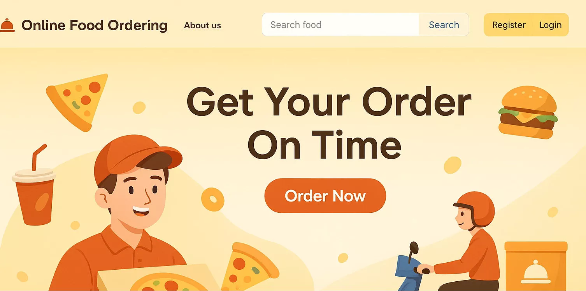

# mini-swiggy

🍕 Online Food Ordering Website
An interactive and responsive online food ordering platform built using Spring Boot (Java) for backend services and HTML, CSS, JavaScript for the frontend. This project offers a seamless experience for customers to browse food items, search, and place orders online.

🚀 Features
Modern and user-friendly web interface

Responsive design for desktop and mobile

Food item search functionality

User registration and login

Order placement and tracking

Backend APIs built using Spring Boot

Project managed with Maven

🛠 Technologies Used
Frontend: HTML5, CSS3, JavaScript

Backend: Java, Spring Boot

Build Tool: Maven

Database: MySQL

📦 Project Setup Instructions
1. Clone the Repository
bash
Copy
Edit
git clone https://github.com/narojuashokkumar/OnlinePizzaOrdering.git
cd mini-swiggy
2. Backend Setup
Import the project into your preferred IDE (e.g., IntelliJ IDEA or Eclipse).

Ensure Maven is installed on your system.

Configure the application.properties file in src/main/resources/.

Run the Spring Boot application:

bash
Copy
Edit
mvn spring-boot:run
3. Frontend Setup
Frontend files are located in src/main/resources/static/.

Customize the HTML/CSS/JS as needed.

🌐 Access the Application
Visit http://localhost:8080 in your browser to explore:

Home Page

Food Search

Login/Register

🤝 Contributing
Contributions are welcome!
Fork this repository and submit a pull request for any enhancements or bug fixes.

📄 License
This project is licensed under the MIT License.

🙋‍♀️ Author
Ashok Naroju

LinkedIn: https://in.linkedin.com/in/ashok-kumar-achari-naroju-914b18225/

GitHub: @narojuashokkumar

📌 Note: This repository currently includes only the Java and JSP files.
If you need the full project (including static resources and configurations), feel free to reach out me at: n.ashok.software@gmail.com
